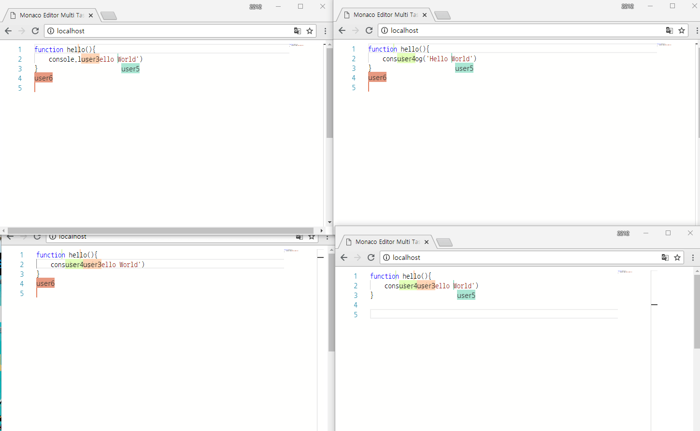
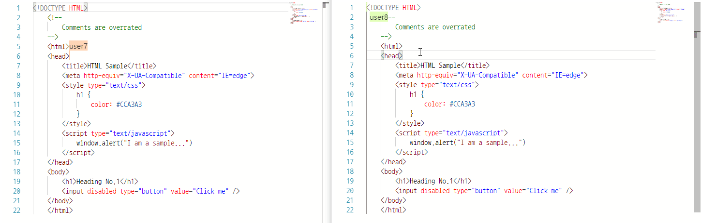
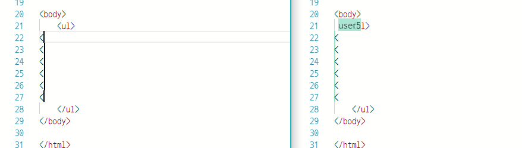

# monaco-editor-socket-io
Monaco Editor with Socket.io Example

## API

* [node.js](https://nodejs.org)
* [Express](http://expressjs.com)
* Socket.io
* [Monaco Editor](https://microsoft.github.io/monaco-editor/)

## Live Coding
Use Live Coding

## Display Selection

## Multi Cursor
